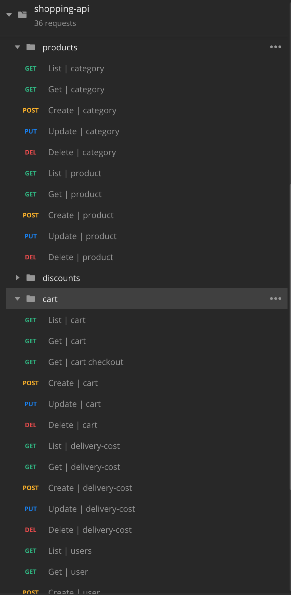
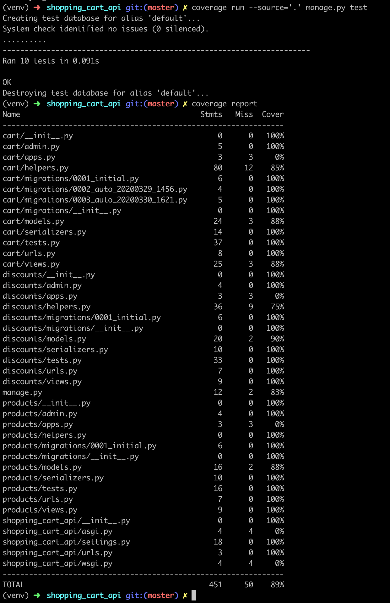

# Shopping Cart API

## Installation
#### Install Python 3:
- Please checkout https://realpython.com/installing-python/
#### Create virtual environment:
- Go to you project directory, then
```shell
> python3 -m venv env
```
```shell
> source env/bin/activate
```
#### Install requirements:
```shell
> pip install -r requirements.txt
```
## Running API Server
```shell
> python manage.py runserver
```
## Postman Collection and Environment

- [Shopping Cart API Collection and Environment](https://github.com/hty8/shopping_cart_api/tree/master/postman)

## Tests
```shell
> coverage run --source='.' manage.py test
```
```shell
> coverage report
```


## Sample Screenshots
- List | Product

- Create New Coupon

- Update Existing Product

- Cart Checkout Example 1

- Cart Checkout Example 2

